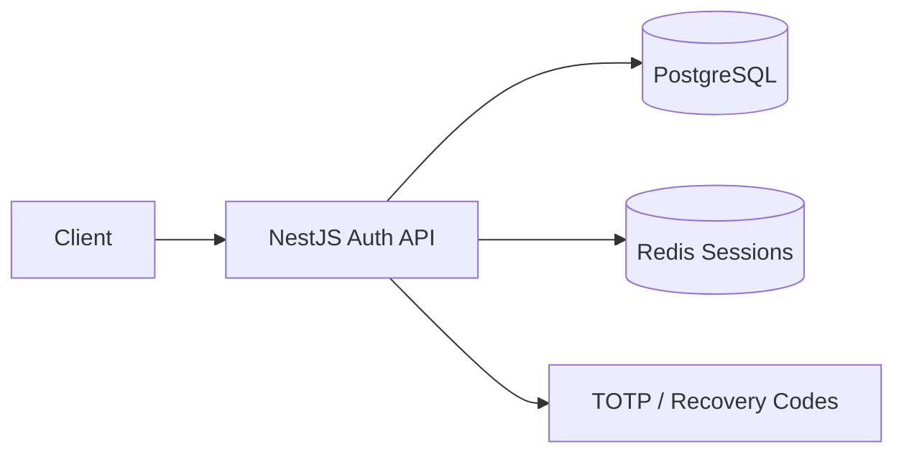
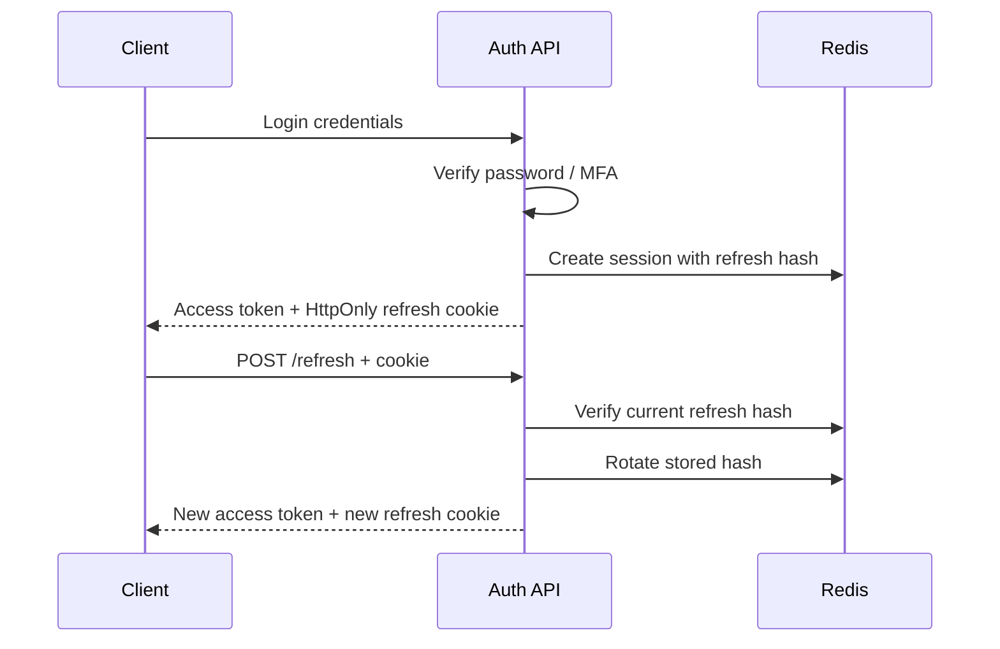

# AuthForge

Secure Authentication & Session Service.

AuthForge is a NestJS authentication portfolio service implementing password security, short-lived JWT access tokens, rotating opaque refresh sessions, MFA, session revocation, RBAC, audit events, PostgreSQL, Redis, and Docker.

## Security Disclaimer

AuthForge is an educational portfolio project intended to demonstrate authentication and session-management concepts. It has not undergone independent security review and should not be used as a drop-in identity platform for production systems.

Mature identity requirements may be better served by established providers and protocols such as OpenID Connect/OAuth-based identity platforms rather than custom authentication code.

## What This Project Demonstrates

- Authentication is proving who the user is.
- Authorization is deciding what an authenticated user may do.
- Passwords are hashed with Argon2id, never stored in plaintext.
- Access tokens are short-lived JWT bearer tokens.
- Refresh tokens are random opaque values stored in an HTTP-only cookie.
- Redis stores refresh-session records and only SHA-256 hashes of refresh tokens.
- Refresh tokens rotate on every successful refresh.
- Consumed refresh-token hashes are retained until session expiry to detect replay.
- MFA enrollment remains pending until a valid TOTP code is confirmed.
- Recovery codes are shown once and stored as Argon2id hashes.
- Audit events are durable PostgreSQL records and do not include credentials or tokens.

## Architecture

PostgreSQL stores users, password-reset tokens, recovery-code hashes, and audit events. Redis stores active refresh sessions, user-session indexes, refresh-hash lookups, and consumed-token markers.

## Token Lifecycle

## Getting Started

1. Copy `.env.example` to `.env`.
2. Replace `JWT_SECRET` with a random value of at least 32 characters.
3. Set `MFA_ENCRYPTION_KEY` to 32 bytes of base64 key material.
4. Start Postgres and Redis with `docker compose up postgres redis -d`.
5. Install dependencies with `npm ci`.
6. Run migrations with `npm run migration:run`.
7. Start the API with `npm run start:dev`.

Swagger is available at `http://localhost:3000/api/docs`.

## Key Endpoints

- `POST /api/v1/auth/register`
- `POST /api/v1/auth/login`
- `POST /api/v1/auth/refresh`
- `POST /api/v1/auth/logout`
- `POST /api/v1/auth/logout-all`
- `GET /api/v1/auth/sessions`
- `DELETE /api/v1/auth/sessions/:sessionId`
- `POST /api/v1/auth/change-password`
- `POST /api/v1/auth/forgot-password`
- `POST /api/v1/auth/reset-password`
- `POST /api/v1/mfa/enroll`
- `POST /api/v1/mfa/confirm`
- `POST /api/v1/auth/mfa/verify`
- `POST /api/v1/mfa/disable`
- `GET /api/v1/users/me`
- `GET /api/v1/admin/audit`
- `GET /api/v1/health/ready`

## Known Limitations

- Custom identity implementation for education.
- Symmetric JWT signing.
- No OAuth 2.0 authorization server.
- No OpenID Connect.
- No passkeys/WebAuthn.
- No external email provider by default.
- Local environment key management.
- No external security audit.
